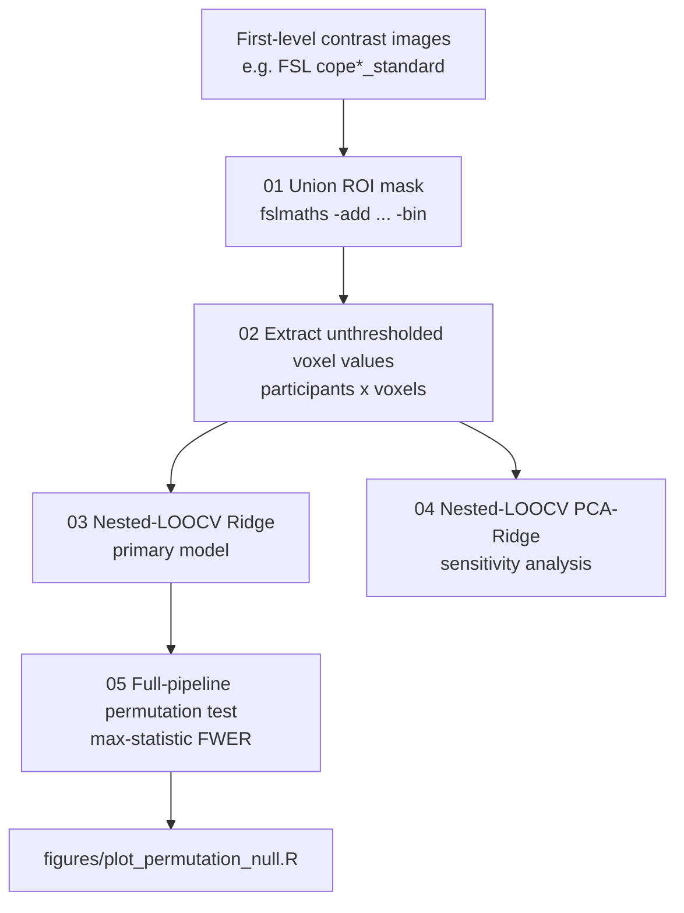
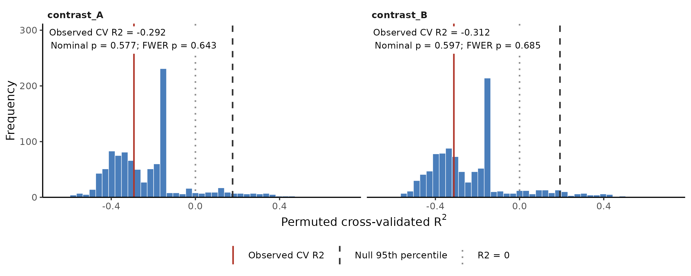
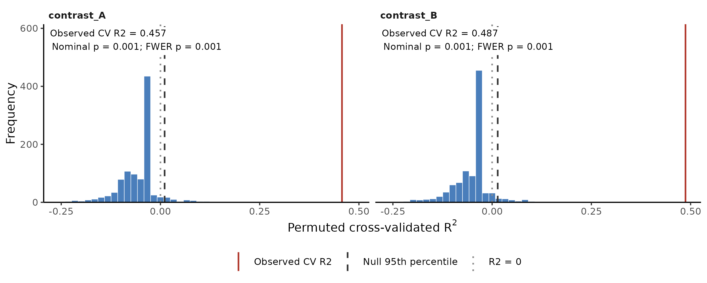

# Leakage-controlled ROI multivoxel prediction for small-sample fMRI

Predict a continuous, participant-level outcome from task-fMRI activation
patterns, with every data-dependent step kept inside the training data.

The pipeline combines:

- **ROI feature extraction:** unthresholded voxel values from a binary union of anatomical ROIs
- **Ridge regression** in voxel space, solved in dual form for p ≫ n
- **Nested leave-one-out cross-validation (LOOCV):** alpha is chosen by inner LOOCV, and performance is measured on genuinely held-out participants
- **A fold-specific training-mean baseline** that any useful model must beat
- **PCA-Ridge sensitivity analysis:** component count and alpha are tuned jointly
- **An exact full-pipeline permutation test** with max-statistic family-wise error (FWER) control across models

It is written with plain NumPy/pandas; the only extra dependency is NiBabel, needed for NIfTI extraction.

## Why this matters

With a dozen or so participants and thousands of voxels, it is very easy to report
impressive-looking "prediction" that is really leakage. Common ways this happens:

- scaling or PCA fitted on all participants
- hyperparameters tuned on the test participant
- voxels selected by their correlation with the outcome

This pipeline is built so that the held-out participant cannot influence
scaling, PCA, hyperparameter selection or model fitting. That property is
tested directly (see [Validation](#validation)).

## Pipeline

**Scope.** The pipeline starts from first-level contrast images (COPEs) in
standard space and binary ROI masks on the same grid. Upstream steps were run
separately in FSL and are not part of this repository: DICOM-to-NIfTI
conversion, FEAT preprocessing and first-level GLM, and the preparation of
atlas-derived ROI masks. Their settings are documented in
[docs/UPSTREAM_PREPROCESSING.md](docs/UPSTREAM_PREPROCESSING.md).



Inside every outer fold:

```
outer-training participants (n-1)
 ├─ inner LOOCV over the alpha grid (scaling refitted in every inner fold)
 ├─ choose alpha with the lowest inner MSE
 └─ refit scaling + Ridge on all outer-training participants
held-out participant ──> one out-of-sample prediction
```

## Quick start (synthetic data)

```bash
git clone https://github.com/altugeskioglu-hue/roi-mvpa-nested-ridge.git
cd roi-mvpa-nested-ridge
pip install -e ".[test]"
pytest -q                                   # 10 correctness tests

# Null scenario: 14 participants, no real signal
python examples/make_synthetic_data.py --output-dir data/null --n-subjects 14 --signal 0 --seed 7
python scripts/03_run_nested_ridge.py      --feature-dir data/null/features --outcome data/null/outcome.csv --output-dir results/null/ridge
python scripts/04_run_nested_pca_ridge.py  --feature-dir data/null/features --outcome data/null/outcome.csv --output-dir results/null/pca_ridge
python scripts/05_run_permutation_test.py  --feature-dir data/null/features --outcome data/null/outcome.csv --output-dir results/null/permutation --n-permutations 1000
Rscript figures/plot_permutation_null.R results/null/permutation

# Positive control: 60 participants with a real signal
python examples/make_synthetic_data.py --output-dir data/signal --n-subjects 60 --signal 1.0 --seed 7
# ...same commands with data/signal and results/signal
```

## Demo results

The same code was run on two synthetic datasets: 2,000 correlated "voxels" and two task contrasts, with 1,000 permutations.

| Scenario | Contrast | Ridge CV R² | Baseline CV R² | PCA-Ridge CV R² | p (nominal) | p (FWER) |
|---|---|---|---|---|---|---|
| Null, n = 14 | A | −0.292 | −0.160 | −0.296 | 0.577 | 0.643 |
| Null, n = 14 | B | −0.312 | −0.160 | −0.315 | 0.597 | 0.685 |
| Signal, n = 60 | A | **0.457** | −0.034 | 0.487 | **0.001** | **0.001** |
| Signal, n = 60 | B | **0.487** | −0.034 | 0.489 | **0.001** | **0.001** |

With no signal, the pipeline does not invent one. With a real signal it recovers it and clearly beats the baseline. The positive control matters: it shows that a null result on real data reflects the data, not a broken pipeline.

| Null scenario (n = 14) | Positive control (n = 60) |
|---|---|
|  |  |

**Why is the baseline CV R² negative?** A leave-one-out training-mean
prediction always sits slightly away from the held-out value. Its CV R² is
exactly 1 − (n / (n − 1))², which is −0.160 for n = 14. When inner CV picks
the largest alpha, Ridge collapses to that same training mean. This produces
the spike in the null distribution and explains why a model with no usable
signal lands at exactly the baseline value.

## Using your own data

1. Build the union mask (inputs must already be binary and on the same grid):
   ```bash
   bash scripts/01_make_union_mask.sh masks/union_2mm.nii.gz roi1_2mm.nii.gz roi2_2mm.nii.gz ...
   ```
2. Write one manifest per contrast, `subject_id,image_path`, in the same row
   order as your outcome file, then extract:
   ```bash
   python scripts/02_extract_features.py --mask masks/union_2mm.nii.gz \
       --manifest manifests/encoding.csv --name encoding --output-dir features/
   ```
3. Provide `outcome.csv` with columns `subject_id,y`.
4. Run scripts 03–05 as in the quick start. Benchmark with
   `--n-permutations 100` before the full run (e.g. 5,000).

Participant order is checked across every file, and the scripts refuse to
overwrite existing extraction or permutation outputs.

## Method details

- **Ridge:** voxels are standardised with the training-fold mean and SD
  (constant voxels keep scale 1). The intercept is unpenalised, and the dual
  form reduces a many-thousand-feature problem to an (n−1) × (n−1) solve.
- **Alpha grid:** 15 log-spaced values from 10⁻⁴ to 10¹⁰. The top of the grid
  is effectively intercept-only, so inner CV can choose "no signal" when
  that fits best.
- **Metrics:** cross-validated R² is primary. Pearson r, MAE and RMSE are
  complementary. Every model is compared with the fold-specific training-mean
  baseline.
- **PCA-Ridge:** scaling → non-whitened PCA (SVD) → Ridge, fitted per fold.
  Inner folds fit PCA once at the largest component count and reuse its
  leading components, which is valid because components are nested. The grid
  is capped by rank (n_train − 1).
- **Permutation test:** for fixed X and folds, a Ridge prediction is linear
  in y. The prediction weights are cached once, and each permutation still
  re-selects alpha from the permuted y in every fold, so the test is exact
  rather than approximate. It uses nominal p = (1 + #null ≥ observed) / (1 + B).
  FWER control compares each observed value with the per-permutation maximum
  across models, and the same permutation is applied to every model.

## Validation

`pytest -q` runs 10 checks:

- the dual Ridge solution equals the textbook primal solution;
- **no leakage:** changing a held-out participant's outcome leaves that participant's own prediction unchanged, for both Ridge and PCA-Ridge;
- reusing leading PCA components equals refitting with fewer components;
- the fast permutation engine reproduces the direct nested-CV code exactly, for observed and permuted outcomes;
- p-values are valid, and FWER-corrected p ≥ nominal p;
- a positive control recovers a real signal.

`05_run_permutation_test.py` also checks the fast engine against the direct
implementation on your data before permuting, and stops if they disagree.

## Limitations

- Label permutation assumes exchangeable participants and no nuisance
  covariates. Adding covariates requires a different permutation scheme.
- LOOCV estimates are high-variance at small n. The PCA-Ridge joint grid
  (component counts × alphas) can make selection unstable, so treat it as a
  sensitivity analysis rather than a replacement for the primary model.
- Linear models on a single task contrast cannot capture nonlinear or
  multimodal effects.

## Repository structure

```
roi_mvpa/            core package: ridge, pca, nested_cv, permutation, metrics, io, features
scripts/             01–05 numbered command-line steps
examples/            synthetic data generator
figures/             R/ggplot2 permutation-null figure
tests/               correctness tests (pytest)
docs/                demo figures and upstream preprocessing notes
```

## Background

I developed this pipeline for my MSc Neuroscience dissertation at King's
College London (Institute of Psychiatry, Psychology & Neuroscience). There I
used it to test whether task-fMRI activation could predict individual
differences in a clinical outcome in a small sample. This repository is a generalised version: it contains no study data,
participant identifiers or study-specific paths. On synthetic data it
reproduces the original analysis scripts exactly, with identical predictions
and hyperparameter selections.

I used AI coding assistants to help draft and debug parts of the code. The
analysis design, validation and interpretation are my own.

## License

MIT, see [LICENSE](LICENSE).
